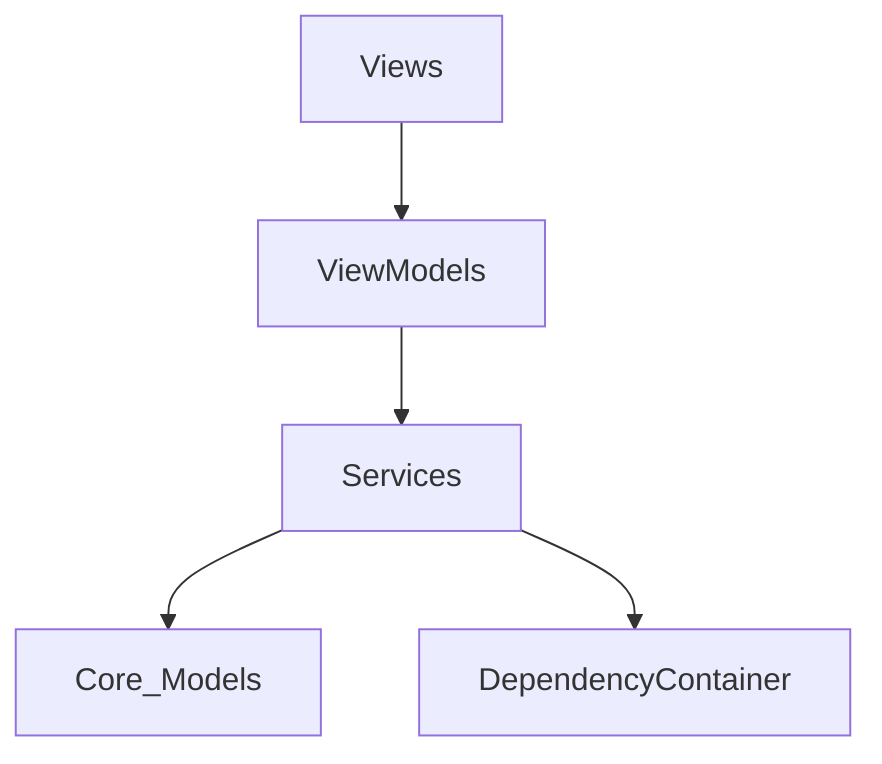

# NovaDesk Architecture

NovaDesk is built using a strict interpretation of Clean Architecture adapted for modern Swift and SwiftUI. The application is divided into distinct, isolated layers to maximize testability, scalability, and performance.

## Core Principles
- **Separation of Concerns**: Business logic is never intertwined with UI code.
- **Protocol-Oriented Programming (POP)**: Services and Repositories are defined by protocols, enabling easy swapping of implementations (e.g., mock vs real).
- **Swift Concurrency**: `async/await` and `@MainActor` are used pervasively to ensure the main thread is never blocked.
- **Observation Framework**: All UI state is driven by `@Observable` classes, reducing the need for Combine publishers and `@Published` properties.

## Layer Breakdown

### 1. Presentation Layer (Views)
- **Framework**: SwiftUI.
- **Role**: Purely declarative UI. It observes state from ViewModels and renders it. It contains NO business logic.
- **Path**: `Sources/Modules/[ModuleName]/[ViewName].swift`

### 2. Presentation Logic (ViewModels)
- **Framework**: Observation (`@Observable`), Swift Concurrency (`@MainActor`).
- **Role**: Orchestrates data flow between the UI and Services. Maintains UI state.
- **Path**: `Sources/Modules/[ModuleName]/[ViewModelName].swift`

### 3. Business Logic (Services)
- **Framework**: Foundation, Swift Concurrency.
- **Role**: Implements core logic (e.g., parsing Git output, fetching from APIs, background indexing).
- **Path**: `Sources/Modules/[ModuleName]/[ServiceName].swift`

### 4. Domain & Data (Models & Repositories)
- **Framework**: SwiftData, Foundation, Codable.
- **Role**: Defines the data structures and persistent storage boundaries.
- **Path**: `Sources/Core/[Models].swift`

## Dependency Injection
We use a lightweight, protocol-based `DependencyContainer` localized in `Sources/Core/DependencyContainer.swift`.
This acts as a service locator allowing ViewModels to resolve protocols to concrete implementations at runtime.

