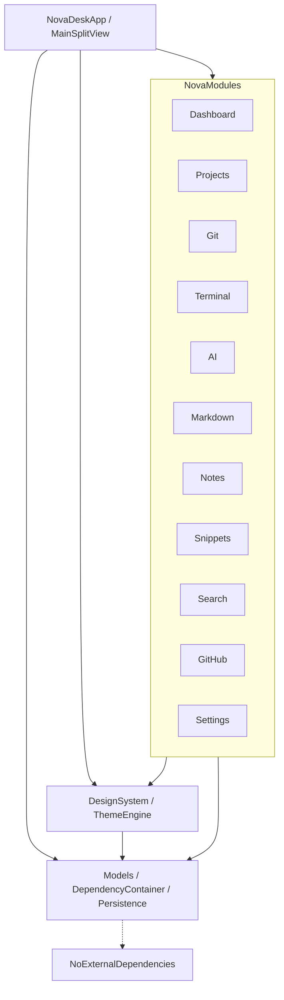

# Dependency Graph

This document illustrates the SPM dependency graph for NovaDesk, showcasing the flow of dependencies enforcing Clean Architecture.

## Explanation
- **Core**: Contains pure domain logic, models, protocols, and the DI container. It depends on nothing else.
- **UIComponents**: Depends only on `Core` (for basic types if needed). Defines styling.
- **NovaModules**: Features depend on `Core` (for abstract protocols and models) and `UIComponents` (for visual rendering). They do not directly depend on each other, preventing circular dependencies.
- **App**: Assembles the application by importing `NovaModules` and injecting concrete services into `Core`'s `DependencyContainer`.
