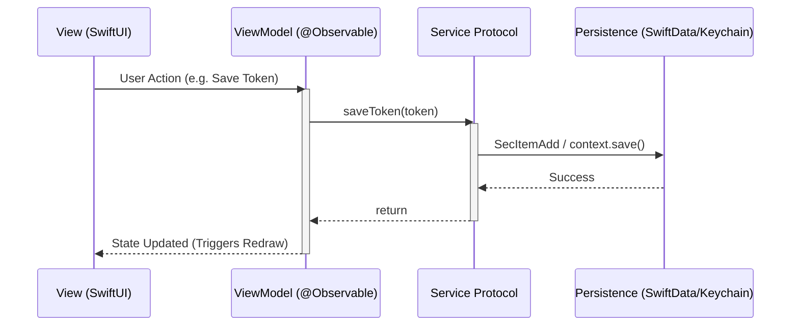

# NovaDesk Data Flow

```mermaid
sequenceDiagram
    participant UI as View (SwiftUI)
    participant VM as ViewModel (@Observable)
    participant Svc as Service Protocol
    participant DB as Persistence (SwiftData/Keychain)
    
    UI->>VM: User Action (e.g. Save Token)
    activate VM
    VM->>Svc: saveToken(token)
    activate Svc
    Svc->>DB: SecItemAdd / context.save()
    DB-->>Svc: Success
    Svc-->>VM: return
    deactivate Svc
    VM-->>UI: State Updated (Triggers Redraw)
    deactivate VM
```
