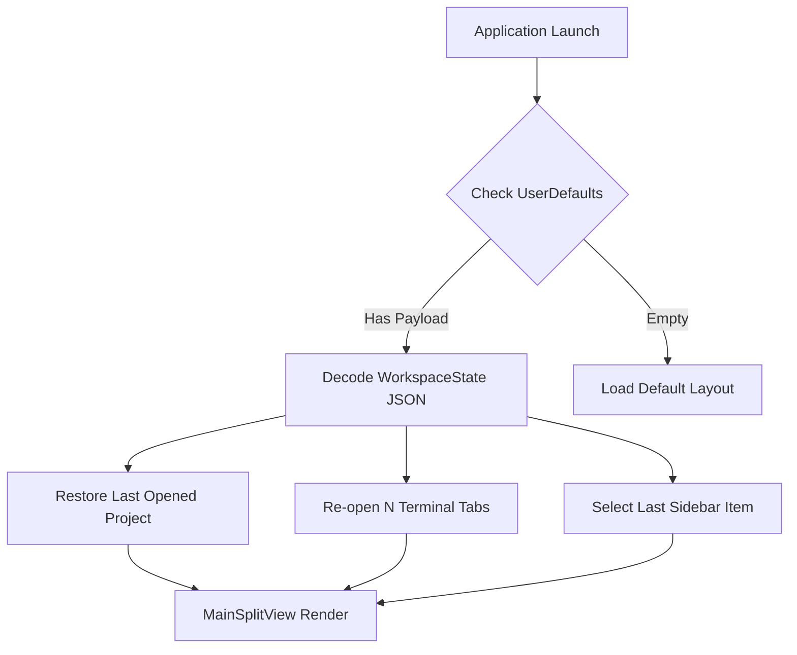

# Workspace Restoration Flow

```mermaid
graph TD
    AppLaunch[Application Launch] --> CheckPrefs{Check UserDefaults}
    CheckPrefs -- Has Payload --> Deserialize[Decode WorkspaceState JSON]
    CheckPrefs -- Empty --> Default[Load Default Layout]
    
    Deserialize --> RestoreProj[Restore Last Opened Project]
    Deserialize --> RestoreTerm[Re-open N Terminal Tabs]
    Deserialize --> RestoreNav[Select Last Sidebar Item]
    
    RestoreProj --> Render[MainSplitView Render]
    RestoreTerm --> Render
    RestoreNav --> Render
```
